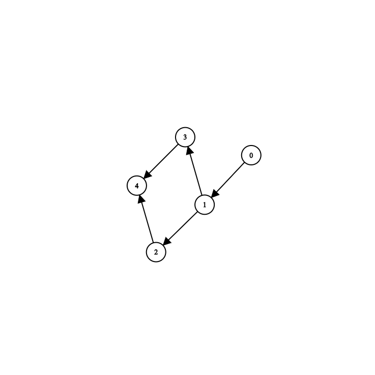

# Graph of Queue Simulation
Follow these basic steps to simulate a graph of queueing stations.

We will be simulating a system with the following structure:

Here each node is a station.

    graph(int init_N, int init_max_queue_len, std::vector<std::vector<std::pair<int, int>>> init_network, std::vector<station> temp);

## Initialisation
Create a station list and add stations to the vector. `std::vector<station> station_list;`

    // 0
    station_list.push_back(station(1,1, 
    [lognormal_values_12_2](float t)-> float 
    { 
        float U = random; 
        int index = (int)(U*lognormal_values_12_2.size());
        try
        {
            return lognormal_values_12_2[index];
        }
        catch(const std::exception& e)
        {
            return lognormal_values_12_2[index-1];
        }
    }));

    //1
    station_list.push_back(station(2,2,
    [lognormal_values_12_2](float t)-> float 
    { 
        float U = random; 
        int index = (int)(U*lognormal_values_12_2.size());
        try
        {
            return lognormal_values_12_2[index];
        }
        catch(const std::exception& e)
        {
            return lognormal_values_12_2[index-1];
        }
    }));

    //2 
    station_list.push_back(station(1,1,
    [lognormal_values_12_2](float t)-> float 
    { 
        float U = random; 
        int index = (int)(U*lognormal_values_12_2.size());
        try
        {
            return lognormal_values_12_2[index];
        }
        catch(const std::exception& e)
        {
            return lognormal_values_12_2[index-1];
        }
    }));

    //3
    station_list.push_back(station(5,5,DepartureTimes));

    //4
    station_list.push_back(station(4,4,
        [lognormal_values_5_2](float t)-> float 
        { 
            float U = random; 
            int index = (int)(U*lognormal_values_5_2.size());
            try
            {
                return lognormal_values_5_2[index];
            }
            catch(const std::exception& e)
            {
                return lognormal_values_5_2[index-1];
            }
        }));

Initialize the adjancency list. We are calling it network here.

    std::vector< std::vector< std::pair<int,int> > > network = {
        {{1,1}},
        {{2,1},{3,1}},
        {{4,1}},
        {{4,1}},
        {}
    };

Create the graph object. `graph station_graph(0,0,network,station_list);`

## Making time variable, counter variables, system state, event list
For discrete-event simulation we need create a global time variable, `t`.

    float t = 0;

We need to create a new counter variable for the arriving customer.

    int arriving_customer = 0;

The event list for departures is kept in the station class and gets automatically updated after each departure.
The event list for arrivals needs to be created manually updated.

    float ta = exponentialrv(0.1);

Now we can move to running the actual simulation.
## Running the discrete-event simulation
We need to set the actual number of discrete events we want in our simulation.        

`int discrete_events = 0;`        

*Every code in this section is for a single discrete-event.* 
- Access the event list and get the minimum departure time of all servers and choose which event   is going to happen.

        std::tie(least_station_index, least_dep_time) = station_graph.find_least_dep_time();
        t = std::min(least_dep_time, ta);

- Run the server updates

        station_graph.server_updates(t);

- Depending on the event ( arrival or departure ), either add customer to the station or do the departure updates.

        if(t == ta)
        {
            station_graph.add_customer_to_graph(t,arriving_customer);
            arriving_customer++;
            ta = Ts_generator(t);
        }
        else
            station_graph.departure_updates(least_station_index,t);

- Increase the number of events.

        discrete_events++;

In the end the loop should look this:

    while(discrete_events<5000)
    {
        std::tie(least_station_index, least_dep_time) = station_graph.find_least_dep_time();

        t = std::min(least_dep_time, ta);

        station_graph.server_updates(t);

        if(t == ta)
        {
            station_graph.add_customer_to_graph(t,arriving_customer);
            arriving_customer++;
            ta = Ts_generator(t);
        }
        else
            station_graph.departure_updates(least_station_index,t);

        discrete_events++;
        std::cout<<discrete_events<<endl;
    }

## Writing the System State in a CSV file
After simulation is over, write the counter variable and system state in a CSV.

    station_graph.write_to_csv("filename");

You can look at the class definition for more details of each function.

